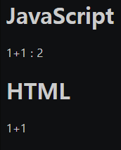
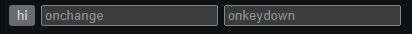
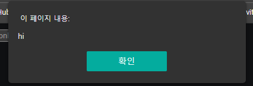

# 2021.10.01(FRI) 생활코딩 WEB2-JavaScript 강의

## WEB2 JavaScript - 1. 수업소개

### Reference
> https://opentutorials.org/module/3180

<br>

## WEB2 JavaScript - 2. 수업의 목적

### Reference
> https://opentutorials.org/module/3180/18868

<br>

## WEB2 JavaScript - 3. HTML과 JS의 만남 : script 태그

- HTML : 정적인 언어
- JavaScript : 동적인 언어

```HTML
<body>
    <h1>JavaScript</h1>
    <script>
        document.write("1+1 : ", 1+1);
    </script>
    
    <h1>HTML</h1>
    1+1
</body>
```


### Reference

> https://opentutorials.org/module/3180/18778

<br>

## WEB2 JavaScript - 4. HTML과 JS의 만남 : 이벤트

- onclick 속성의 속성값으로는 반드시 "JavaScript"과 와야 함
- 웹브라우저에서 일어나는 일을 "이벤트"라고 함

```HTML
<body>
    <input type="button" value="hi" onclick="alert('hi')">
    <input type="text" placeholder="onchange" onchange="alert('changed!')">
    <input type="text" placeholder="onkeydown" onkeydown="alert('key down!')">
</body>
```

- button을 누르면 "hi"라는 경고문이 출력된다.
- onchange에 이전과 다른 문자를 입력하면 "changed!"라는 경고문이 출력된다.
- onclickdown에 문자를 입력하면 "key down!"이라는 경고문이 출력된다.



<br>

### Reference
> https://opentutorials.org/module/3180/18782