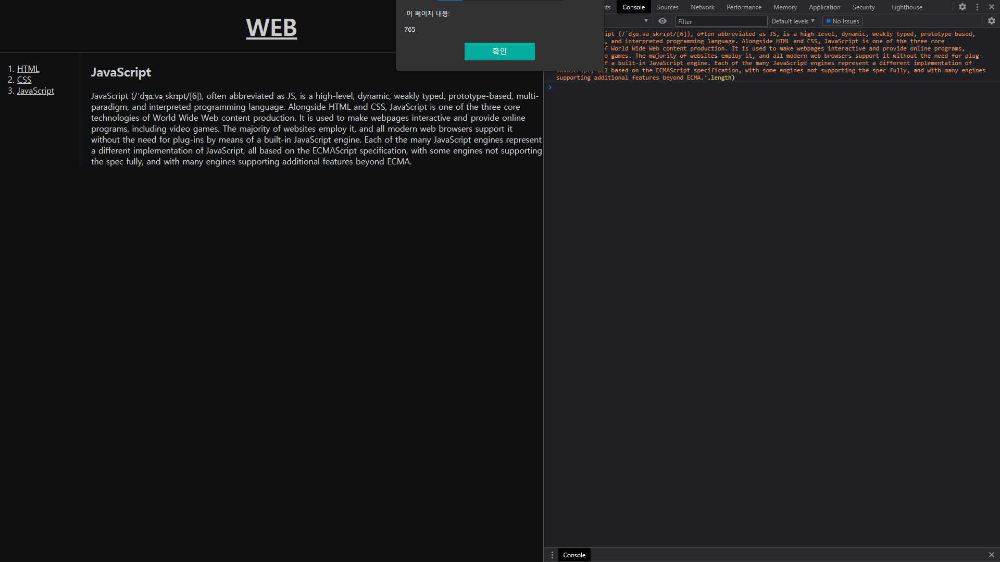

# 2021.10.02(SAT) 생활코딩 WEB2-JavaScript 강의

## WEB2 JavaScript - 5.HTML과 JS의 만남 (콘솔)

- 파일을 작성해서 실행하는 것이 아니라, 경우에 따라서는 가볍게 실행하고 싶은 코드가 있을 수 있다. 이 때 사용할 수 있는 기능이 콘솔(console) 기능이다. 웹페이지에서 오른쪽 마우스를 눌러 검사를 클릭하면 콘솔 탭이 있는 것을 확인할 수 있다.

- 예를 들어, 콘솔 창에서 length 함수를 사용하여 웹페이지의 글자의 개수를 구할 수도 있다.

### Reference
> https://opentutorials.org/module/3180/18869

 

## WEB2 JavaScript - 6.데이터타입 - 문자열과 숫자

- C언어나 Python 등에서 배운 문자열과 숫자에 대해 설명한 강의였다. 기존에 이미 알던 내용이라 따로 정리하지는 않기로 한다.

## Reference
> https://opentutorials.org/module/3180/18870