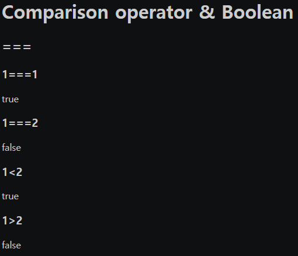

# 2021.10.06(WED) 생활코딩 WEB2-JavaScript 강의

## WEB2 JavaScript - 12. 제어할 태그 선택하기

- "JavaScript select tag by css selector"를 [구글에 검색](https://www.w3schools.com/jsref/met_document_queryselector.asp)하여 `document.querySelector('바꾸려는 클래스')`를 입력하면 JavaScript에서 CSS 선택자를 사용할 수 있다는 것을 알게 되었다.

- 이를 토대로 "JavaScript background color"를 검색하니 [링크](https://www.w3schools.com/jsref/prop_style_backgroundcolor.asp)에서 `document.body.style.backgoundColor = "red";`를 사용하면 색깔이 바뀌는 것 또한 알게 되었다. 이를 상황에 맞게 변형해주었다.

```HTML
최종코드

<!DOCTYPE html>
<html>
    <head>
        <meta charset="utf-8">
        <title>WEB2 - JavaScript</title>
    </head>

    <body>
        <h1>WEB</h1>
        <input type="button" value="night" onclick="
            document.querySelector('body').style.backgroundColor = 'black';
            document.querySelector('body').style.color = 'white';
            ">
        <input type="button" value="day" onclick="
            document.querySelector('body').style.backgroundColor = 'white';
            document.querySelector('body').style.color = 'black';
        ">
        <ol>
            <li><a href="1.html">HTML</a></li>
            <li><a href="2.html">CSS</a></li>
            <li><a href="3.html">JavaScript</a></li>
        </ol>

        <h2>JavaScript</h2>
        <p>
            JavaScript (/ˈdʒɑːvəˌskrɪpt/[6]), often abbreviated as JS, is a high-level, dynamic, weakly typed, prototype-based, multi-paradigm, and interpreted programming technologies of World Wide Web content production. It is used to make webpages interactive and provide online programs, including video games. The majority of websites employ it, and all modern web browsers support it without the need for plug-ins by means of a built-in JavaScript engine. Each of the many JavaScript engines represent a different implementation of JavaScript, all based on the ECMAScript specification, with some engines not supporting the spec fully, and with many 
            engines supporting additional features beyond ECMA.
        </p>
    </body>
</html>
```
<br>

### Reference
> https://opentutorials.org/course/3085/18792

<br>

## WEB2 JavaScript - 13. 프로그램, 프로그래밍, 프로그래머

- Program : 순서
- Programming : 순서를 만드는 행위
- Programmer : 그 순서를 만드는 사람

웹페이지는 시간의 순서에 따라 무엇을 할 필요가 없기 때문에 `HTML은 프로그래밍 언어가 아니라고 생각한다`. 반면에 JavaScript는 사용자의 요구에 따라 시간의 순서에 맞게 무언가를 구현해야한다. 따라서 `JavaScript는 프로그래밍 언어이다`.

처음에는 단순히 시간을 나열하는 것에 만족했지만, 조건에 따라서 다른 기능이 실행되게도 하고 싶어지기 시작했다. 또 반복되는 작업과 이로 인해 복잡해지는 순서(코드)를 잘 정리하고 싶어졌다. 이러한 인간의 욕구 덕분에 새로운 기능들이 추가되었고 이를 다음 강의에서부터 배워보도록 한다.

> 프로그램엔 순서'라는 의미가 깊숙히 자리잡고있다.
순서에 '패턴'이 발생한다면 굳이, 계속, 일일이 반복할 이유가 사라진다. 싫증난다. 
그래서 프로그램을 짜고 그에 걸맞는 언어를 만들어냈다.
처음엔 단순히 '의도'에 맞게 시간에 따라 나열하는 것에 만족했지만
인간의 욕심은 끝이 없었고 그 의도가 점차 복잡해지고 커졌다. 
점차 조건에 따라 달라지기를 바랬고, 특정한 무언가를 반복시키고 싶었다. 
또한 복잡해지는 코드를 잘 정리정돈하고 싶었다. 
그래서 언어는 계속 발전해 나아간다.<br><br>
출처 : 해당 영상 유튜브 댓글(김준식님)

### Reference
> https://opentutorials.org/course/3085/18876

<br>

## WEB2 JavaScript - 14. 조건문 예고

- 토글 기능 구현 예정 : 버튼 한개로 주간모드(day), 야간모드(night) 변경하는 방법

### Reference
> https://opentutorials.org/course/3085/18879

<br>

## WEB2 JavaScript - 15. 비교 연산자와 블리언

- 비교연산자 : ===
- Boolean : True, False
- 파이썬, C언어에서 배운 내용이라 빠르게 넘김
<br>

### 실행결과


<br>

### Reference
> https://opentutorials.org/course/3085/18798