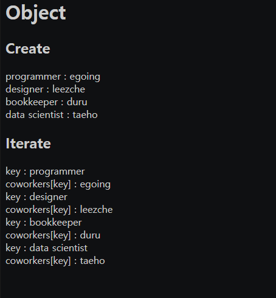
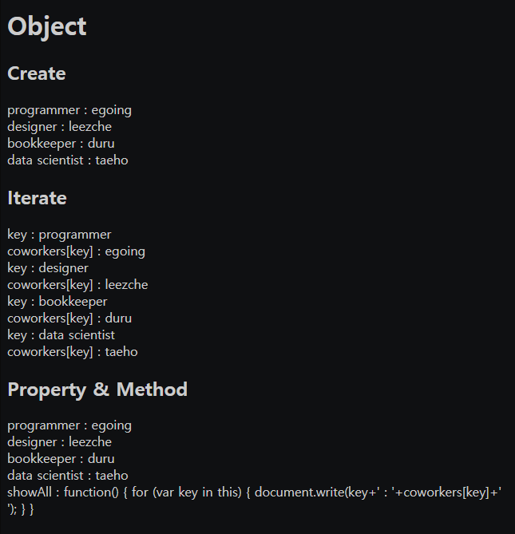

# 2021.10.14(THU) 생활코딩 WEB2-JavaScript 강의

## WEB2 JavaScript - 31. 객체와 반복문

- 반복문을 사용하여 객체 출력(파이썬과 유사)
- key값과 value 값(파이썬과 유사)
<br>

### 전체코드
```HTML
<body>
    <h1>Object</h1>
    <h2>Create</h2>
    <script>
        var coworkers = {
            "programmer" : "egoing",
            "designer" : "leezche"
        };
        document.write("programmer : "+coworkers.programmer+"<br>");
        document.write("designer : "+coworkers.designer+"<br>");
        coworkers.bookkeeper = "duru";
        document.write("bookkeeper : "+coworkers.bookkeeper+"<br>");
        coworkers["data scientist"] = "taeho";
        document.write("data scientist : "+coworkers["data scientist"]+"<br>");
    </script>
    <h2>Iterate</h2>
    <script>
        for(var key in coworkers) {
            document.write('key : '+key+'<br>')
            document.write('coworkers[key] : '+coworkers[key]+'<br>')
        }
    </script>
</body>
```
`출력 결과`


### Reference
> https://opentutorials.org/course/3085/18853

<br>

## WEB2 JavaScript - 32. 객체프로퍼티와 메소드

- 메소드 : 객체에 소속된 함수
- 프로퍼티 : 객체에 소속된 변수
- `this`를 자주 활용하면 변수를 사용하는 것보다 편하다.

### 전체 코드
```HTML
<!DOCTYPE html>
<html>
    <head>
        <meta charset="utf-8">
    </head>

    <body>
        <h1>Object</h1>
        <h2>Create</h2>
        <script>
            var coworkers = {
                "programmer" : "egoing",
                "designer" : "leezche"
            };
            document.write("programmer : "+coworkers.programmer+"<br>");
            document.write("designer : "+coworkers.designer+"<br>");
            coworkers.bookkeeper = "duru";
            document.write("bookkeeper : "+coworkers.bookkeeper+"<br>");
            coworkers["data scientist"] = "taeho";
            document.write("data scientist : "+coworkers["data scientist"]+"<br>");
        </script>
        <h2>Iterate</h2>
        <script>
            for(var key in coworkers) {
                document.write('key : '+key+'<br>')
                document.write('coworkers[key] : '+coworkers[key]+'<br>')
            }
        </script>
        <h2>Property & Method</h2>
        <script>
            coworkers.showAll = function() {
                for (var key in this) {
                    document.write(key+' : '+coworkers[key]+'<br>');
                }
            }
            coworkers.showAll();
        </script>
    </body>
</html>
```
`출력 결과`


### Reference
> https://opentutorials.org/course/3085/18853

<br>

## WEB2 JavaScript - 33. 객체의 활용

- 객체에 함수를 저장할 수도 있다.

### Reference
> https://opentutorials.org/course/3085/18885